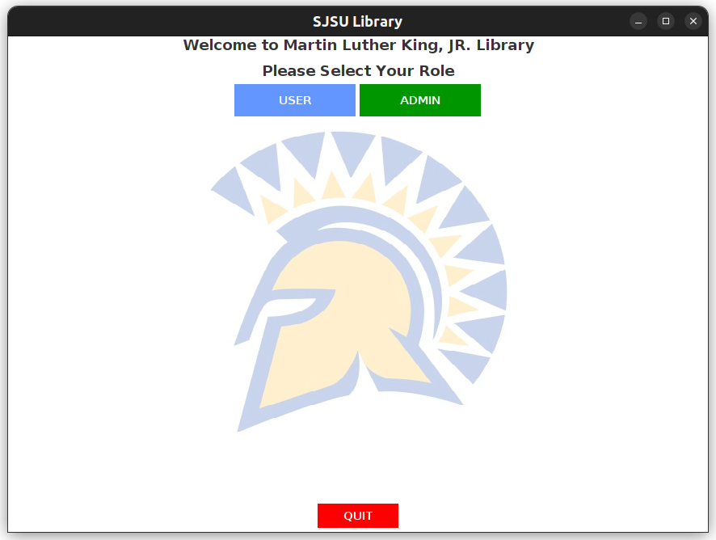
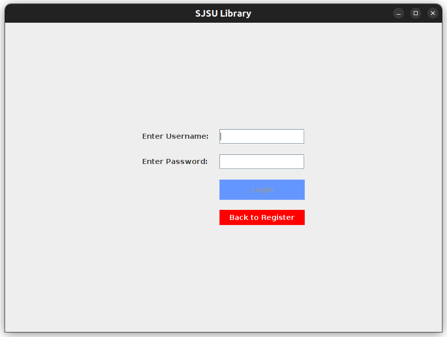
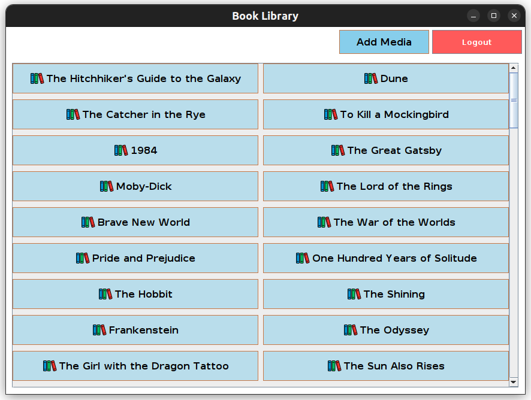
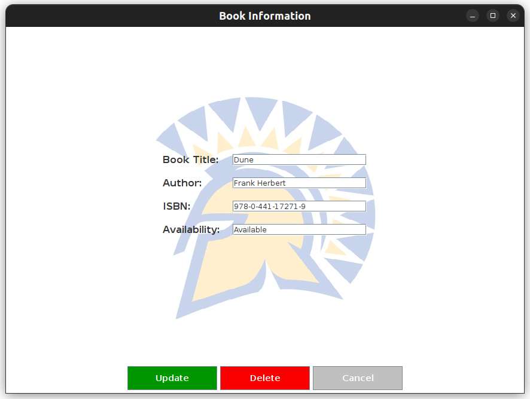
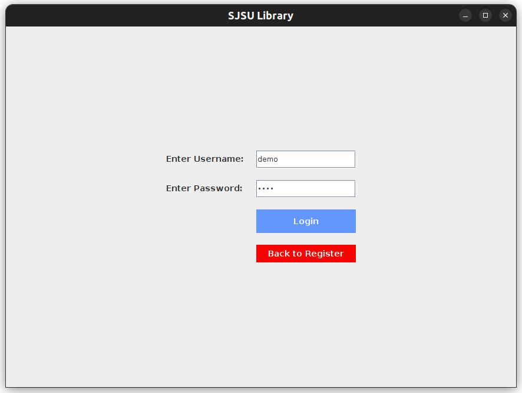
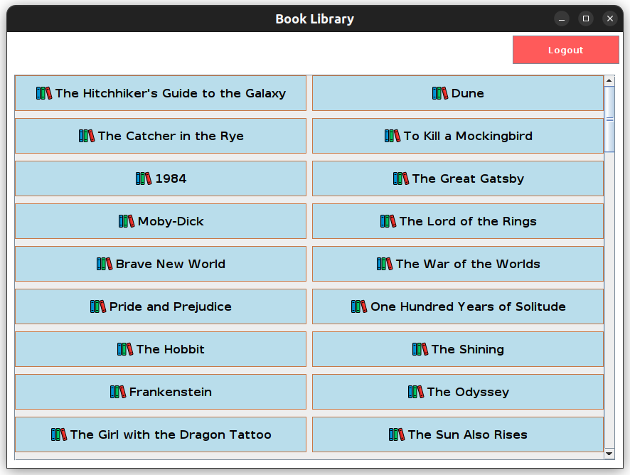
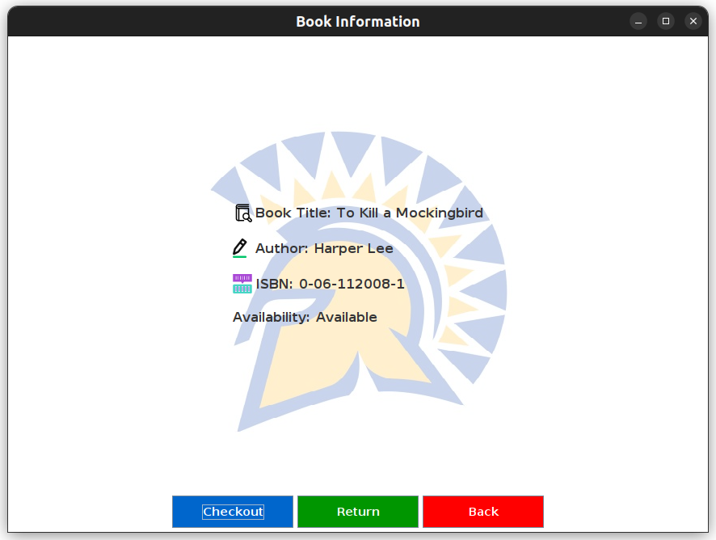

# CS151 Library Management System - Team Taco

## Team Members

- [Daniel H](class-diagram.pdf)
- [Sean Hsieh](https://github.com/ShangchenHsieh)
- [Yar Moradpour](https://github.com/khmorad)

## Project Proposal Contribution

- Daniel: Contributed to brainstorming ideas and provided the final review.
- Sean: Involved in brainstorming ideas and led the proposal writing.
- Yar: Participated in brainstorming ideas and contributed to the proposal writing.

## Project Presentation Contribution

- Daniel (Backend Developer): Demonstrated the authentication system and explained its implementation.
- Sean (Frontend Developer): Demonstrated all frontend pages and provided insights into their development.
- Yar (Backend Developer): Demonstrated the database functionalities and explained their implementation.

## Project Source Code & Report Contribution

- Daniel: Implemented the LMSController class and integrated it with view pages.
- Sean: Implemented all frontend pages, including button functionalities and action listeners.
- Yar: Developed the database functionality and seamlessly integrated it into LMSController.

## Project Overview

The CS151 Library Management System was developed to address the local library's need for digitizing their book collection, aimed at facilitating user interaction with the library catalog and reducing the workload on librarians. This web-accessible application offers a user-friendly interface for efficient library management.

## Diagrams

- Daniel: [UML Class Diagram](/diagrams/class-diagram.pdf)
- Sean: [State Diagram](/diagrams/state-diagram.pdf)
- Yar: [Sequence Diagram](/diagrams/sequential-diagram.pdf)

## Features & Functionality

The system empowers librarians with complete administrative control over library items, enabling CRUD (Create, Read, Update, Delete) operations. Users can seamlessly perform actions such as checking out, returning, adding, deleting, and updating various library items, including books, theses, video tapes, etc.

## Solution Implementation

Built using Java and Java Swing, the interactive user interface enhances user and librarian experiences. The system enables a range of operations critical for library management, fostering improved efficiency and a superior user experience.

## Usage Instructions

### For Windows Users:

1. Double-click on the `App.jar` file.

### For Linux Users:

1. Navigate to the project directory.
2. Execute the command `java -jar App.jar` to start the application.

## Screenshots

### Admin Section

1. Index Page
   
2. Login Page
   
3. Admin Media List
   
4. Add Media
   
5. Update Media
   

### User Section

1. User Register Page
   
2. User Login Page
   
3. User Media List
   
4. User Single Media View
   
